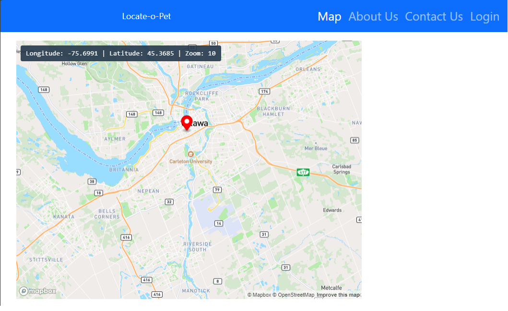

	
	
	
	
	
	

# Carlton Coding Bootcamp Certification

	
Table of Contents

	<ol>
		<li><a href="#Description">Locate-O-Pet</a></li>
		<li><a href="#installation">Installation</a></li>
		<li><a href="#usage">Application Usage</a></li>
		<li><a href="#contactme">Questions? Contact Me!</a></li>
		<li><a href="#license">License</a></li>
	</ol>

## Locate-O-Pet

Description entered automatically by Lorem Ipsum. Aut, nobis quod earum, dolores accusamus modi libero possimus nam et aliquam non, blanditiis saepe. quod earum, dolores accusamus modi libero possimus nam et. Aut, nobis quod earum, dolores accusamus modi libero possimus nam et aliquam non, blanditiis saepe. quod earum, dolores accusamus modi libero possimus nam et.

Lorem ipsum dolor, sit amet consectetur adipisicing elit. Doloribus natus iure dolorum aperiam itaque? Ipsam ad quidem quo neque aliquam natus blanditiis totam. Rerum accusantium fugit, alias numquam tenetur nemo necessitatibus laudantium officiis. Reprehenderit dolor labore iusto ut minus fugiat tempora, expedita corrupti. Ab tenetur similique ipsa dolore odio earum aliquam animi ducimus optio quibusdam ipsam eos ipsum perferendis, perspiciatis quasi temporibus. Aliquam perspiciatis dolorum est expedita quo possimus, quas temporibus pariatur mollitia debitis. Ducimus sapiente impedit culpa eos alias voluptas minima corporis veniam commodi perspiciatis. At quaerat quas porro veritatis sapiente nihil fugit cumque voluptatum voluptatem recusandae alias nulla iusto, quam exercitationem, ipsa corrupti possimus eligendi repellendus!

Here is our product!

	

(<a href="#readme-top">back to top</a>)

## Installation

The JATE (Just Another Text Editor) requires two tiers; Server and client. Each one requires their own independant dependancies. Please follow the instructions to install the JATE application

|Name|Description |
|---|---|
|[Locate-O-Pet][mernportfolio]| Navigate to WOW React Portfolio github repo and clone application. |
|[install-dependancies][]| Once main depandancies have been installed then run this script: `npm run install` |
|[build-develop][] | Run script `npm run build`. This script will compile and create the application, it generates the `dist` folder with all components. |
|[dev][] | Once application has been built we can run script `npm run dev` to execute application. |

[mernportfolio]: https://github.com/Jake66Martin/Locate-O-Pet
[main-dependancies]: main-dependacies
[install-dependancies]: install-dependacies
[build-develop]: build-develop
[dev]: start

### List of application and developing dependencies

To specify the packages your project depends on, you must add them in a package.json file as "dependencies" or "devDependencies" in your package's package.json file. When you (or another user) run npm install, npm will download dependencies and devDependencies that are listed in package.json that meet the semantic version requirements listed for each. NOTE: devDependencies are only installed when developing, these are NOT included when publishing application.

	
Server Dependencies. (click on arrow to expand)

	

Application dependencies:

> @apollo/server - version 4.7.1 
> apollo-server-express - version 3.6.2 
> bcrypt - version 4.0.1 
> express - version 4.17.1 
> jsonwebtoken - version 8.5.1 
> graphql - version 16.6.0 
> mongoose - version 7.0.2

	
Client Dependencies. (click on arrow to expand)

	

Application dependencies:

> @apollo/client - version 3.7.14 
> bootstrap - version 5.2.3 
> graphql - version 16.6.0 
> jwt-decode - version 3.1.2 
> mapbox-gl - version 3.1.0 
> phone - version 3.1.42 
> react - version 18.2.0 
> react-bootstrap - version 2.7.4 
> react-dom - version 18.2.0 
> react-router-dom - version 6.11.2 
> react-scripts - version 4.0.3 
> sweetalert2 - version 11.10.4

(<a href="#readme-top">back to top</a>)

## Application Usage

Application usage entered automatically by Lorem Ipsum. Lorem ipsum dolor, sit amet consectetur adipisicing elit. Doloribus natus iure dolorum aperiam itaque? Ipsam ad quidem quo neque aliquam natus blanditiis totam. Rerum accusantium fugit, alias numquam tenetur nemo necessitatibus laudantium officiis. Reprehenderit dolor labore iusto ut minus fugiat tempora, expedita corrupti. Ab tenetur similique ipsa dolore odio earum aliquam animi ducimus optio quibusdam ipsam eos ipsum perferendis, perspiciatis quasi temporibus. Aliquam perspiciatis dolorum est expedita quo possimus, quas temporibus pariatur mollitia debitis. Ducimus sapiente impedit culpa eos alias voluptas minima corporis veniam commodi perspiciatis. At quaerat quas porro veritatis sapiente nihil fugit cumque voluptatum voluptatem recusandae alias nulla iusto, quam exercitationem, ipsa corrupti possimus eligendi repellendus!

(<a href="#readme-top">back to top</a>)

## Questions? Contact Me 

This is our last group project and we tried to show off in our new skills. Locate-O-Pet is ReactJS Web application that offer pet owners use the help of the community to locate and rescue their loved pets. The application has plenty of room for growing, we hope you find it encouraging and sparks some great ideas!

Do not hesitate in contacting us at: 
> Sonja Gorin 
> Jacob Martin 
> Gustavo Miller - gustavo.miller@miller-hs.com. 

You may find the application at: [https://github.com/Jake66Martin/Locate-O-Pet](https://github.com/Jake66Martin/Locate-O-Pet)

(<a href="#readme-top">back to top</a>)

## License

MIT License

Copyright (c) 2023 Readme-Bot

Permission is hereby granted, free of charge, to any person obtaining a copy of this software and associated documentation files (the "Software"), to deal in the Software without restriction, including without limitation the rights to use, copy, modify, merge, publish, distribute, sublicense, and/or sell copies of the Software, and to permit persons to whom the Software is furnished to do so, subject to the following conditions:

The above copyright notice and this permission notice shall be included in all copies or substantial portions of the Software.

THE SOFTWARE IS PROVIDED "AS IS", WITHOUT WARRANTY OF ANY KIND, EXPRESS OR IMPLIED, INCLUDING BUT NOT LIMITED TO THE WARRANTIES OF MERCHANTABILITY, FITNESS FOR A PARTICULAR PURPOSE AND NONINFRINGEMENT. IN NO EVENT SHALL THE AUTHORS OR COPYRIGHT HOLDERS BE LIABLE FOR ANY CLAIM, DAMAGES OR OTHER LIABILITY, WHETHER IN AN ACTION OF CONTRACT, TORT OR OTHERWISE, ARISING FROM, OUT OF OR IN CONNECTION WITH THE SOFTWARE OR THE USE OR OTHER DEALINGS IN THE SOFTWARE.

(<a href="#readme-top">back to top</a>)

---
© 2024 edX Boot Camps LLC. Confidential and Proprietary. All Rights Reserved. Developed by Gustavo Miller.