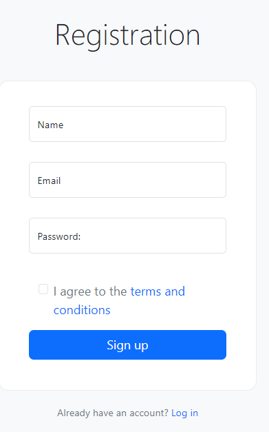
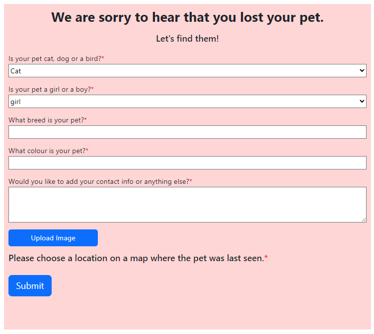

 

	
	
	
	
	
	

# Carlton Coding Bootcamp Certification

	
Table of Contents

	<ol>
		<li><a href="#Description">Locate-O-Pet</a></li>
		<li><a href="#installation">Installation</a></li>
		<li><a href="#usage">Application Usage</a></li>
		<li><a href="#contactme">Questions? Contact Me!</a></li>
		<li><a href="#license">License</a></li>
	</ol>

## Locate-O-Pet

After long weeks in learning new skills, reading and working in our assignments, it all comes to this last project. This last project would be the opportunity to demnstrate our new skills, ready to either continue studying or seeking for a job. Once agian this is a group project, an opportunity to build a scalable MERN-stack single-page application that fulfills a real-world need, with a focus on data and user demand.

Have you ever lost something, anything? you wallet, you car keys? now you have it, now you don't! Imagine loosing your pet. Well, Locate-O-Pet is an application that will help you find your pet, by getting the community involved. You register, report where was the last time you have seen your pet, and other people would be able to notify seeing them.

Pet owners would be able to register, put a picture of their pet, add warnings -if necesary, and place a pin in the map. The map-pin would show the pet image and contact number. Additional personal information can be added to their profiles.

The application has been developed using MERN full stack web development. MERN stands for MongoDB, Express, React, Node, after the four key technologies that make up the stack. In MERN, Express and Node make up the middle (application) tier. Express.js is a server-side web framework, and Node.js is the popular and powerful JavaScript server platform. Hope you enjoy our application!

Here is our product!

	

(<a href="#readme-top">back to top</a>)

## Installation

The Locate-O-Pet requires -like any other MERN fullstack, two tiers; Server and client. Each one requires their own independant dependancies. Please follow the instructions to install the application

|Name|Description |
|---|---|
|[Locate-O-Pet][mernportfolio]| Navigate to Locate-O-Pet github repo and clone application. |
|[install-dependancies][]| The application uses multiple depandancies -distributed alond the tiers. To install them, run this script: `npm run install` or `npm i` and node do the rest. |
|[development][] | Once application has been built we can run script `npm run dev` to execute application. |

[mernportfolio]: https://github.com/Jake66Martin/Locate-O-Pet
[install-dependancies]: install-dependacies
[development]: start

### List of application and developing dependencies

To specify the packages your project depends on, you must add them in a package.json file as "dependencies" or "devDependencies" in your package's package.json file. When you (or another user) run npm install, npm will download dependencies and devDependencies that are listed in package.json that meet the semantic version requirements listed for each. NOTE: devDependencies are only installed when developing, these are NOT included when publishing application.

	
Server Dependencies. (click on arrow to expand)

	

Application dependencies:

> @apollo/server - version 4.7.1 
> apollo-server-express - version 3.6.2 
> bcrypt - version 4.0.1 
> express - version 4.17.1 
> jsonwebtoken - version 8.5.1 
> graphql - version 16.6.0 
> mongoose - version 7.0.2

	
Client Dependencies. (click on arrow to expand)

	

Application dependencies:

> @apollo/client - version 3.7.14 
> @cloudinary/react - version 1.4.0 
> @cloudinary/url-gen - version 1.8.0 
> bootstrap - version 5.2.3 
> graphql - version 16.6.0 
> jwt-decode - version 3.1.2 
> mapbox-gl - version 3.1.0 
> phone - version 3.1.42 
> react - version 18.2.0 
> react-bootstrap - version 2.7.4 
> react-dom - version 18.2.0 
> react-router-dom - version 6.11.2 
> react-scripts - version 4.0.3 
> sweetalert2 - version 11.10.4

(<a href="#readme-top">back to top</a>)

## Application Usage

Using Locate-O-Pet is very simple! Open application -phone or computer, sign in for a new profile, regiter your lost pet, add an image and your contact information. Let the community do the rest. For a regular user (not a lost pet owners), locate the pet you have spotted and report seeing the pet to the owner. User can call or post a note, including an image. All images are stored in Cloudinary, a cloud-based media management platform that enables users to upload, store, manage, manipulate, and deliver images and video for websites and apps.

The application is published in Render -a cloud platform for deploying and managing applications, so there is no aditional requirement to get the application working.

### Registering to Locate-O-Pet Database
Even though you don't have to register to see lost pets, you do when you want to report a lost pet. The registration is simple. 

 

Registration form. (click on arrow to expand)

	

 

<ol>
<li>Goto to the login screen</li>
<li>Click on register link</li>
<li>Provide your name or nick name</li>
<li>Enter a valid email address</li>
<li>Create a password - Password must be of 8 characters minimum. Must contain one of each lowercase, uppercase, digit, and special character.</li>
<li>Register your lost pet</li>
</ol>

### Reporting a lost pet
As a member of Locate-O-Pet database you can report a lost pet for the community to see. Reporting a lost pet is simple, from the map page (main page) select the "I lost a pet" or "I saw a pet" in case you want to report owner where you saw their pet.

Note: you must register and be logged in, before you can report a pet.

 

Reporting a Lost Pet form. (click on arrow to expand)

	

 

(<a href="#readme-top">back to top</a>)

## Questions? Contact Me 

This is our last group project and we tried to show off in our new skills. Locate-O-Pet is ReactJS Web application that offer pet owners use the help of the community to locate and rescue their loved pets. The application has plenty of room for growing, we hope you find it encouraging and sparks some great ideas!

Do not hesitate in contacting us at: 
> Sonja Gorin 
> Jacob Martin 
> Gustavo Miller - gustavo.miller@miller-hs.com. 

You may find the application at: [https://github.com/Jake66Martin/Locate-O-Pet](https://github.com/Jake66Martin/Locate-O-Pet)

(<a href="#readme-top">back to top</a>)

## License

MIT License

Copyright (c) 2024 Locate-O-Pet

Permission is hereby granted, free of charge, to any person obtaining a copy of this software and associated documentation files (the "Software"), to deal in the Software without restriction, including without limitation the rights to use, copy, modify, merge, publish, distribute, sublicense, and/or sell copies of the Software, and to permit persons to whom the Software is furnished to do so, subject to the following conditions:

The above copyright notice and this permission notice shall be included in all copies or substantial portions of the Software.

THE SOFTWARE IS PROVIDED "AS IS", WITHOUT WARRANTY OF ANY KIND, EXPRESS OR IMPLIED, INCLUDING BUT NOT LIMITED TO THE WARRANTIES OF MERCHANTABILITY, FITNESS FOR A PARTICULAR PURPOSE AND NONINFRINGEMENT. IN NO EVENT SHALL THE AUTHORS OR COPYRIGHT HOLDERS BE LIABLE FOR ANY CLAIM, DAMAGES OR OTHER LIABILITY, WHETHER IN AN ACTION OF CONTRACT, TORT OR OTHERWISE, ARISING FROM, OUT OF OR IN CONNECTION WITH THE SOFTWARE OR THE USE OR OTHER DEALINGS IN THE SOFTWARE.

(<a href="#readme-top">back to top</a>)

---
© 2024 edX Boot Camps LLC. Confidential and Proprietary. All Rights Reserved. Developed by Gustavo Miller.